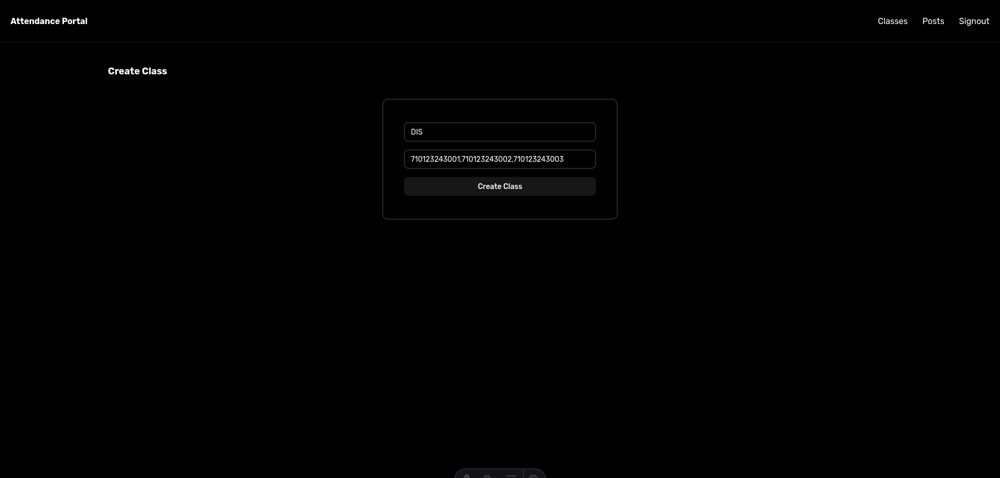
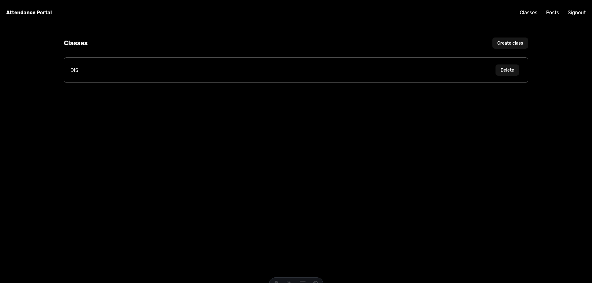
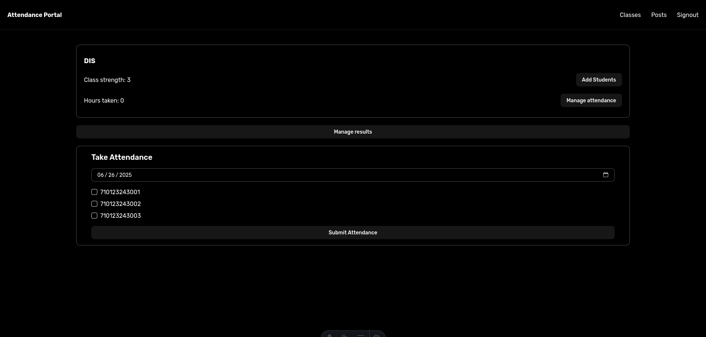
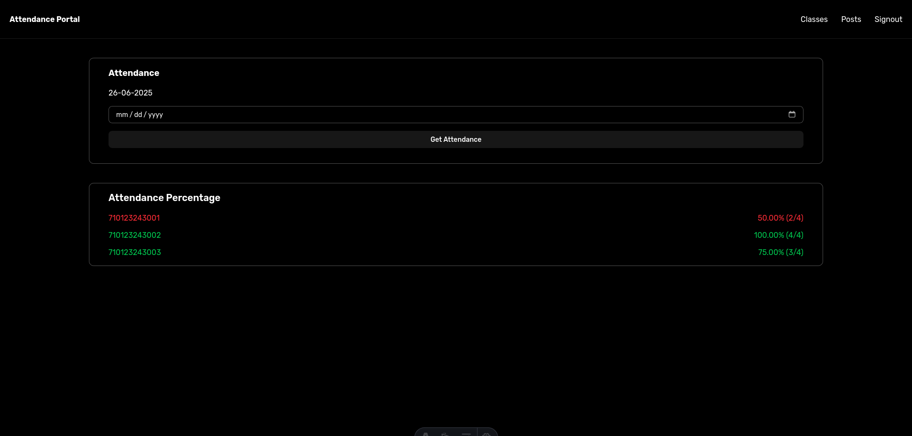
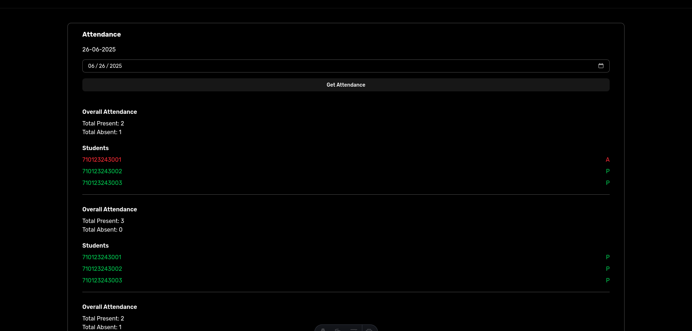
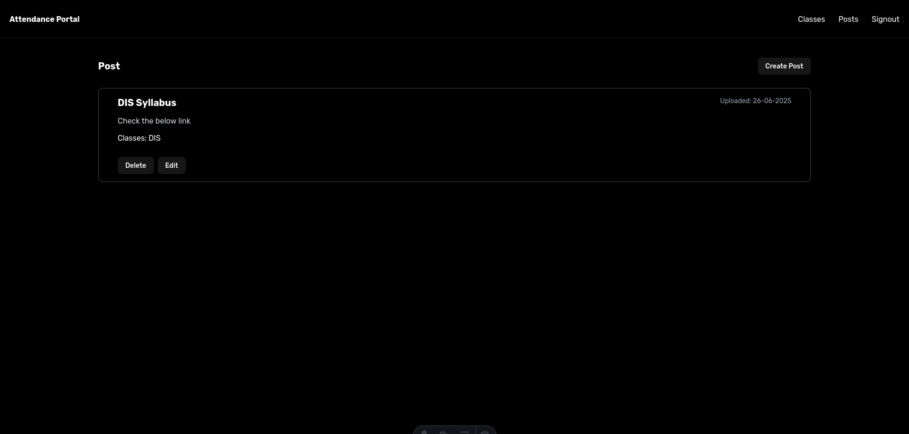
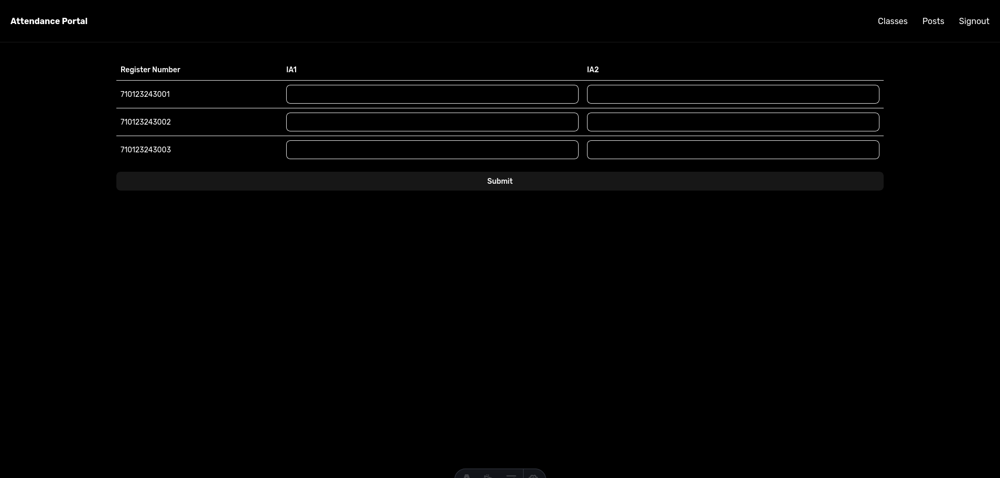
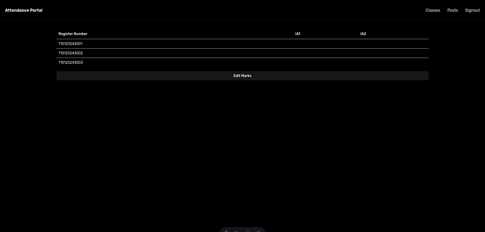
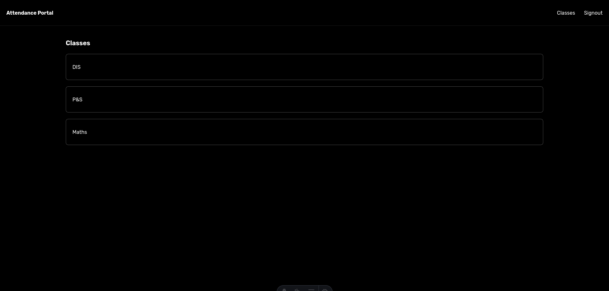
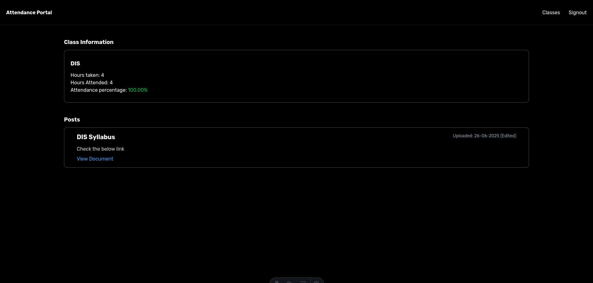

# 🎓 Student Attendance Portal

A full-stack web application for managing and tracking student attendance and communication between staff and students.

## 🧩 Tech Stack

- **Frontend**: Astro + React + TypeScript  
- **UI Components**: [ShadCN UI](https://ui.shadcn.dev/)
- **Backend**: [Hono](https://hono.dev/) (TypeScript)
- **ORM**: [Prisma](https://www.prisma.io/)
- **Database**: PostgreSQL (or any Prisma-supported DB)

---

## 🌐 Features

### 🔒 Staff Dashboard

- Create and manage classes
- Add students to classes
- Mark attendance for each class session
- View attendance percentages for all students
- Create and manage posts (notices, updates, etc.)

### 🧑‍🎓 Student Portal

- View attendance for all enrolled classes
- Track attendance percentage
- View posts/announcements shared by staff

---

## 🛠️ Installation

```bash
git clone https://github.com/dev-spectre/portal.git student-attendance-portal
cd student-attendance-portal
```

---

## Screenshots

### Dashboard



















### Student Portal





